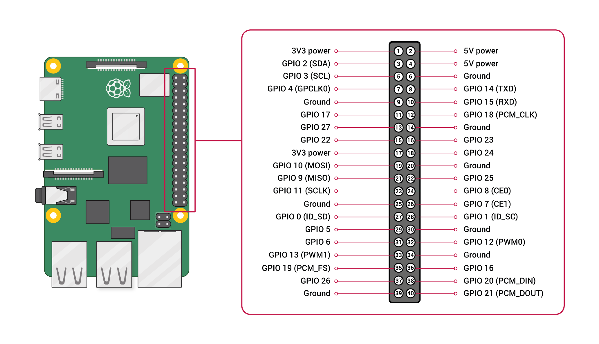

# Raspberry Pi 5 40-Pin GPIO 引腳對照說明 / Pinout Guide

| 中文                                                                                                                      | English                                                                                                                                                                                               |
| ------------------------------------------------------------------------------------------------------------------------- | ----------------------------------------------------------------------------------------------------------------------------------------------------------------------------------------------------- |
| 本文整理 Raspberry Pi 5 的 40-pin GPIO 排針對照表，搭配圖片與功能分類，方便在接線、查腳位、閱讀感測器模組規格時快速對照。 | This document provides a clear reference for the Raspberry Pi 5 40-pin GPIO header, including the pinout diagram, a full pin mapping table, grouped interface categories, and practical wiring notes. |

## 參考圖 / Reference Diagram

## 使用前先知道 / Before You Start

| 中文                                                                                              | English                                                                                                     |
| ------------------------------------------------------------------------------------------------- | ----------------------------------------------------------------------------------------------------------- |
| Raspberry Pi 5 的 GPIO 邏輯電平為**3.3V**。                                                 | The Raspberry Pi 5 GPIO logic level is**3.3V**.                                                       |
| **不可直接輸入 5V 到 GPIO 腳位。**                                                          | **Do not apply 5V directly to GPIO pins.**                                                            |
| 實體排針共有**40 pins**，分成左右兩排。                                                     | The header has**40 physical pins** arranged in two columns.                                           |
| 一般採用**實體腳位編號（Physical Pin Number）** 與 **BCM / GPIO 編號** 兩種方式對照。 | Two numbering styles are commonly used:**physical pin numbering** and **BCM / GPIO numbering**. |
| 本文件中的`GPIO 2`、`GPIO 14` 等名稱，指的是 **BCM GPIO 編號**。                        | In this guide, names such as`GPIO 2` and `GPIO 14` refer to the **BCM GPIO numbering scheme**.    |

## 編號方向 / Pin Numbering Orientation

| 中文                                                | English                                                                                   |
| --------------------------------------------------- | ----------------------------------------------------------------------------------------- |
| 當 Raspberry Pi 5 正面朝上、40-pin 排針位於右側時： | When the Raspberry Pi 5 is viewed from the top, with the 40-pin header on the right side: |
| 左排由上到下為奇數腳：`1, 3, 5, ..., 39`          | The left column contains odd-numbered pins:`1, 3, 5, ..., 39`                           |
| 右排由上到下為偶數腳：`2, 4, 6, ..., 40`          | The right column contains even-numbered pins:`2, 4, 6, ..., 40`                         |

## 40-pin 引腳完整對照表 / Full 40-Pin Mapping Table

| 實體腳位 Physical Pin | 功能 Function           | 實體腳位 Physical Pin | 功能 Function           |
| --------------------- | ----------------------- | --------------------- | ----------------------- |
| 1                     | 3.3V 電源 / 3.3V Power  | 2                     | 5V 電源 / 5V Power      |
| 3                     | GPIO 2 (SDA)            | 4                     | 5V 電源 / 5V Power      |
| 5                     | GPIO 3 (SCL)            | 6                     | 接地 GND / Ground (GND) |
| 7                     | GPIO 4 (GPCLK0)         | 8                     | GPIO 14 (TXD)           |
| 9                     | 接地 GND / Ground (GND) | 10                    | GPIO 15 (RXD)           |
| 11                    | GPIO 17                 | 12                    | GPIO 18 (PCM_CLK)       |
| 13                    | GPIO 27                 | 14                    | 接地 GND / Ground (GND) |
| 15                    | GPIO 22                 | 16                    | GPIO 23                 |
| 17                    | 3.3V 電源 / 3.3V Power  | 18                    | GPIO 24                 |
| 19                    | GPIO 10 (MOSI)          | 20                    | 接地 GND / Ground (GND) |
| 21                    | GPIO 9 (MISO)           | 22                    | GPIO 25                 |
| 23                    | GPIO 11 (SCLK)          | 24                    | GPIO 8 (CE0)            |
| 25                    | 接地 GND / Ground (GND) | 26                    | GPIO 7 (CE1)            |
| 27                    | GPIO 0 (ID_SD)          | 28                    | GPIO 1 (ID_SC)          |
| 29                    | GPIO 5                  | 30                    | 接地 GND / Ground (GND) |
| 31                    | GPIO 6                  | 32                    | GPIO 12 (PWM0)          |
| 33                    | GPIO 13 (PWM1)          | 34                    | 接地 GND / Ground (GND) |
| 35                    | GPIO 19 (PCM_FS)        | 36                    | GPIO 16                 |
| 37                    | GPIO 26                 | 38                    | GPIO 20 (PCM_DIN)       |
| 39                    | 接地 GND / Ground (GND) | 40                    | GPIO 21 (PCM_DOUT)      |

## 依功能分類整理 / Pin Groups by Function

### 1. 電源腳位 / Power Pins

| 類型 Type | 腳位 Pins                                                    |
| --------- | ------------------------------------------------------------ |
| 3.3V      | `1`, `17`                                                |
| 5V        | `2`, `4`                                                 |
| GND       | `6`, `9`, `14`, `20`, `25`, `30`, `34`, `39` |

### 2. I2C 腳位 / I2C Pins

| 介面 Interface | 腳位 Pins              |
| -------------- | ---------------------- |
| SDA            | `Pin 3` = `GPIO 2` |
| SCL            | `Pin 5` = `GPIO 3` |

#### Pin 3 與 Pin 5 的差別 / Difference Between Pin 3 and Pin 5

| 中文 | English |
| --- | --- |
| `Pin 3` 是 `GPIO 2 (SDA)`，屬於 I2C 的資料線。 | `Pin 3` is `GPIO 2 (SDA)`, which serves as the I2C data line. |
| `Pin 5` 是 `GPIO 3 (SCL)`，屬於 I2C 的時脈線。 | `Pin 5` is `GPIO 3 (SCL)`, which serves as the I2C clock line. |
| `SDA`（Serial Data）負責傳送與接收資料。 | `SDA` (Serial Data) is used to send and receive data. |
| `SCL`（Serial Clock）負責提供通訊節奏，讓裝置知道何時讀寫資料。 | `SCL` (Serial Clock) provides the timing signal so devices know when to read or write data. |
| 實際接線時，模組的 `SDA` 通常接到 Raspberry Pi 的 `Pin 3`，模組的 `SCL` 通常接到 `Pin 5`。 | In typical wiring, a module's `SDA` pin connects to Raspberry Pi `Pin 3`, and its `SCL` pin connects to `Pin 5`. |

| 中文            | English                              |
| --------------- | ------------------------------------ |
| I2C 感測器      | I2C sensors                          |
| OLED 顯示器     | OLED displays                        |
| IMU、溫濕度模組 | IMU and environmental sensor modules |

### 3. UART 腳位 / UART Pins

| 介面 Interface | 腳位 Pins                |
| -------------- | ------------------------ |
| TXD            | `Pin 8` = `GPIO 14`  |
| RXD            | `Pin 10` = `GPIO 15` |

| 中文         | English                        |
| ------------ | ------------------------------ |
| 串列通訊     | Serial communication           |
| 連接微控制器 | Connecting to microcontrollers |
| 除錯 Console | Debug console access           |

### 4. SPI 腳位 / SPI Pins

| 介面 Interface | 腳位 Pins                |
| -------------- | ------------------------ |
| MOSI           | `Pin 19` = `GPIO 10` |
| MISO           | `Pin 21` = `GPIO 9`  |
| SCLK           | `Pin 23` = `GPIO 11` |
| CE0            | `Pin 24` = `GPIO 8`  |
| CE1            | `Pin 26` = `GPIO 7`  |

| 中文             | English                      |
| ---------------- | ---------------------------- |
| ADC / DAC 模組   | ADC and DAC modules          |
| 高速感測器       | High-speed sensors           |
| 顯示器與儲存裝置 | Displays and storage devices |

### 5. PWM 腳位 / PWM Pins

| PWM  | 腳位 Pins                |
| ---- | ------------------------ |
| PWM0 | `Pin 32` = `GPIO 12` |
| PWM1 | `Pin 33` = `GPIO 13` |

| 中文         | English                    |
| ------------ | -------------------------- |
| 伺服馬達控制 | Servo motor control        |
| LED 亮度調整 | LED brightness control     |
| 馬達驅動訊號 | Motor driver signal output |

### 6. PCM / I2S 相關腳位 / PCM / I2S Related Pins

| 介面 Interface | 腳位 Pins                |
| -------------- | ------------------------ |
| PCM_CLK        | `Pin 12` = `GPIO 18` |
| PCM_FS         | `Pin 35` = `GPIO 19` |
| PCM_DIN        | `Pin 38` = `GPIO 20` |
| PCM_DOUT       | `Pin 40` = `GPIO 21` |

| 中文         | English               |
| ------------ | --------------------- |
| 數位音訊裝置 | Digital audio devices |
| I2S 麥克風   | I2S microphones       |
| 音訊編解碼器 | Audio codecs          |

## 常見 GPIO 腳位整理 / Common General-Purpose GPIO Pins

| 中文                                          | English                                                               |
| --------------------------------------------- | --------------------------------------------------------------------- |
| 以下腳位常被當作一般輸入 / 輸出（GPIO）使用： | The following pins are often used as standard GPIO input/output pins: |

`GPIO 4`, `GPIO 17`, `GPIO 27`, `GPIO 22`, `GPIO 23`, `GPIO 24`, `GPIO 25`, `GPIO 5`, `GPIO 6`, `GPIO 16`, `GPIO 26`

## 接線注意事項 / Wiring Notes

| 中文                                                                                   | English                                                                                                                 |
| -------------------------------------------------------------------------------------- | ----------------------------------------------------------------------------------------------------------------------- |
| **不要把 5V 訊號直接接到 GPIO 腳位**，否則可能損壞樹莓派。                       | **Do not connect a 5V signal directly to a GPIO pin.**                                                            |
| 若是要把外部 5V 電源輸入到 Raspberry Pi 供電，應接到 `Pin 2` 或 `Pin 4`。         | If you are feeding external 5V power into the Raspberry Pi, use `Pin 2` or `Pin 4`.                               |
| **不要把 5V 電源接到 `Pin 1` 或 `Pin 17`**，因為這兩個是 `3.3V` 電源腳。          | **Do not connect 5V power to `Pin 1` or `Pin 17`**, because those are `3.3V` power pins.                         |
| 接感測器或模組前，先確認其工作電壓是`3.3V` 還是 `5V`。                             | Always check whether your sensor or module requires`3.3V` or `5V`.                                                  |
| 若使用馬達、繼電器、伺服機等負載，建議搭配驅動板或外部供電，不要直接由 GPIO 輸出驅動。 | For motors, relays, and servos, use a driver board or external power supply instead of driving them directly from GPIO. |
| 若接線後程式沒有反應，先確認使用的是實體腳位編號還是 BCM 編號。                        | If your circuit does not work as expected, first check whether you are using physical pin numbering or BCM numbering.   |
| 確認地線`GND` 是否共地。                                                             | Check whether the device shares a common`GND`.                                                                        |
| 確認介面功能（`I2C` / `SPI` / `UART`）是否已在系統中啟用。                       | Check whether the required interface (`I2C`, `SPI`, or `UART`) is enabled in the system.                          |

## 快速查表 / Quick Reference

| 中文                                                                  | English                                                               |
| --------------------------------------------------------------------- | --------------------------------------------------------------------- |
| `3.3V`：`1`, `17`                                               | `3.3V`: `1`, `17`                                               |
| `5V`：`2`, `4`                                                  | `5V`: `2`, `4`                                                  |
| `GND`：`6`, `9`, `14`, `20`, `25`, `30`, `34`, `39` | `GND`: `6`, `9`, `14`, `20`, `25`, `30`, `34`, `39` |
| `I2C`：`3 (SDA)`, `5 (SCL)`                                     | `I2C`: `3 (SDA)`, `5 (SCL)`                                     |
| `UART`：`8 (TXD)`, `10 (RXD)`                                   | `UART`: `8 (TXD)`, `10 (RXD)`                                   |
| `SPI`：`19`, `21`, `23`, `24`, `26`                       | `SPI`: `19`, `21`, `23`, `24`, `26`                       |
| `PWM`：`32`, `33`                                               | `PWM`: `32`, `33`                                               |

## 檔案資訊 / File Information

| 中文                                                    | English                                                        |
| ------------------------------------------------------- | -------------------------------------------------------------- |
| 圖片來源：`GPIO-Pinout-Diagram-2.png`                 | Image source:`GPIO-Pinout-Diagram-2.png`                     |
| 文件用途：Raspberry Pi 5 40-pin GPIO 引腳對照與接線說明 | Purpose: Raspberry Pi 5 40-pin GPIO reference and wiring guide |
