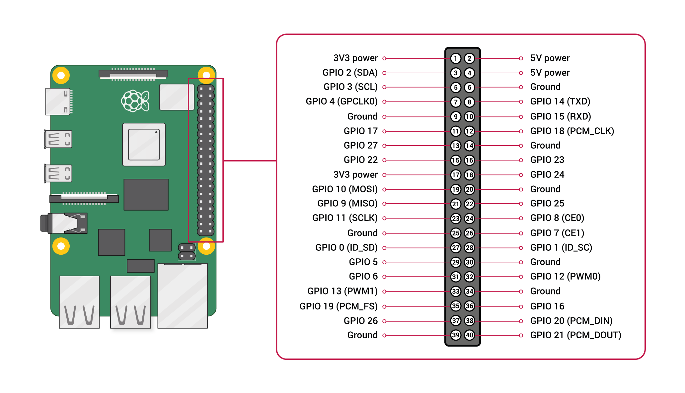

# Raspberry Pi 5 40-Pin GPIO Pinout Guide

This document provides a clear reference for the Raspberry Pi 5 40-pin GPIO header, including the pinout diagram, a full pin mapping table, grouped interface categories, and practical wiring notes.

## Reference Diagram

## Before You Start

- The Raspberry Pi 5 GPIO logic level is **3.3V**.
- **Do not apply 5V directly to GPIO pins.**
- The header has **40 physical pins** arranged in two columns.
- In this guide, names such as `GPIO 2` and `GPIO 14` refer to the **BCM GPIO numbering scheme**.

## Pin Numbering Orientation

When the Raspberry Pi 5 is viewed from the top, with the 40-pin header on the right side:

- The left column contains odd-numbered pins: `1, 3, 5, ..., 39`
- The right column contains even-numbered pins: `2, 4, 6, ..., 40`

## Full 40-Pin Mapping Table

| Physical Pin | Function | Physical Pin | Function |
|---|---|---|---|
| 1 | 3.3V Power | 2 | 5V Power |
| 3 | GPIO 2 (SDA) | 4 | 5V Power |
| 5 | GPIO 3 (SCL) | 6 | Ground (GND) |
| 7 | GPIO 4 (GPCLK0) | 8 | GPIO 14 (TXD) |
| 9 | Ground (GND) | 10 | GPIO 15 (RXD) |
| 11 | GPIO 17 | 12 | GPIO 18 (PCM_CLK) |
| 13 | GPIO 27 | 14 | Ground (GND) |
| 15 | GPIO 22 | 16 | GPIO 23 |
| 17 | 3.3V Power | 18 | GPIO 24 |
| 19 | GPIO 10 (MOSI) | 20 | Ground (GND) |
| 21 | GPIO 9 (MISO) | 22 | GPIO 25 |
| 23 | GPIO 11 (SCLK) | 24 | GPIO 8 (CE0) |
| 25 | Ground (GND) | 26 | GPIO 7 (CE1) |
| 27 | GPIO 0 (ID_SD) | 28 | GPIO 1 (ID_SC) |
| 29 | GPIO 5 | 30 | Ground (GND) |
| 31 | GPIO 6 | 32 | GPIO 12 (PWM0) |
| 33 | GPIO 13 (PWM1) | 34 | Ground (GND) |
| 35 | GPIO 19 (PCM_FS) | 36 | GPIO 16 |
| 37 | GPIO 26 | 38 | GPIO 20 (PCM_DIN) |
| 39 | Ground (GND) | 40 | GPIO 21 (PCM_DOUT) |

## Pin Groups by Function

### 1. Power Pins

| Type | Pins |
|---|---|
| 3.3V | `1`, `17` |
| 5V | `2`, `4` |
| GND | `6`, `9`, `14`, `20`, `25`, `30`, `34`, `39` |

### 2. I2C Pins

| Interface | Pins |
|---|---|
| SDA | `Pin 3` = `GPIO 2` |
| SCL | `Pin 5` = `GPIO 3` |

Common uses:
- I2C sensors
- OLED displays
- IMU and environmental sensor modules

### 3. UART Pins

| Interface | Pins |
|---|---|
| TXD | `Pin 8` = `GPIO 14` |
| RXD | `Pin 10` = `GPIO 15` |

Common uses:
- Serial communication
- Connecting to microcontrollers
- Debug console access

### 4. SPI Pins

| Interface | Pins |
|---|---|
| MOSI | `Pin 19` = `GPIO 10` |
| MISO | `Pin 21` = `GPIO 9` |
| SCLK | `Pin 23` = `GPIO 11` |
| CE0 | `Pin 24` = `GPIO 8` |
| CE1 | `Pin 26` = `GPIO 7` |

Common uses:
- ADC and DAC modules
- High-speed sensors
- Displays and storage devices

### 5. PWM Pins

| PWM | Pins |
|---|---|
| PWM0 | `Pin 32` = `GPIO 12` |
| PWM1 | `Pin 33` = `GPIO 13` |

Common uses:
- Servo motor control
- LED brightness control
- Motor driver signal output

### 6. PCM / I2S Related Pins

| Interface | Pins |
|---|---|
| PCM_CLK | `Pin 12` = `GPIO 18` |
| PCM_FS | `Pin 35` = `GPIO 19` |
| PCM_DIN | `Pin 38` = `GPIO 20` |
| PCM_DOUT | `Pin 40` = `GPIO 21` |

Common uses:
- Digital audio devices
- I2S microphones
- Audio codecs

## Common General-Purpose GPIO Pins

The following pins are often used as standard GPIO input/output pins:

`GPIO 4`, `GPIO 17`, `GPIO 27`, `GPIO 22`, `GPIO 23`, `GPIO 24`, `GPIO 25`, `GPIO 5`, `GPIO 6`, `GPIO 16`, `GPIO 26`

## Wiring Notes

1. **Do not connect a 5V signal directly to a GPIO pin.**
2. Always check whether your sensor or module requires `3.3V` or `5V`.
3. For motors, relays, and servos, use a driver board or external power supply instead of driving them directly from GPIO.
4. If your circuit does not work as expected, check:
   - whether you are using physical pin numbering or BCM numbering
   - whether the device shares a common `GND`
   - whether the required interface (`I2C`, `SPI`, or `UART`) is enabled in the system

## Quick Reference

- `3.3V`: `1`, `17`
- `5V`: `2`, `4`
- `GND`: `6`, `9`, `14`, `20`, `25`, `30`, `34`, `39`
- `I2C`: `3 (SDA)`, `5 (SCL)`
- `UART`: `8 (TXD)`, `10 (RXD)`
- `SPI`: `19`, `21`, `23`, `24`, `26`
- `PWM`: `32`, `33`

## File Information

- Image source: `GPIO-Pinout-Diagram-2.png`
- Purpose: Raspberry Pi 5 40-pin GPIO reference and wiring guide
