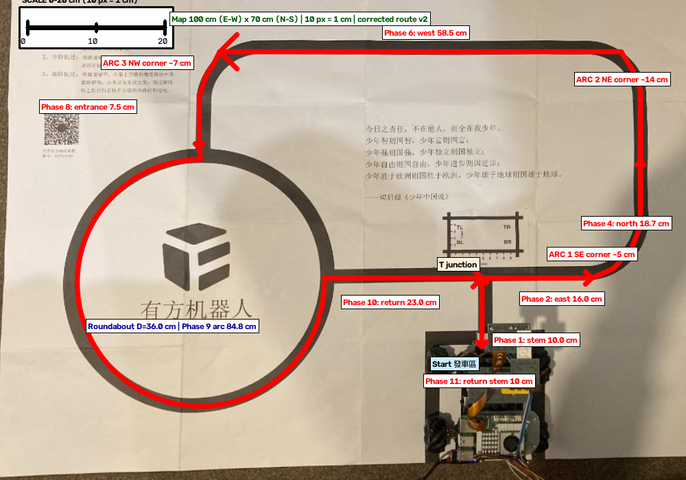

# 任務一全自動導航單一事實來源規格報告 (Single Source of Truth Specification)

> [!IMPORTANT]
> 本文件為《車輛與機器人手臂》專案「任務一全自動巡線與圓環導航」之唯一權威規格書 (Single Source of Truth)。本報告**直接採用使用者最新上傳實拍照片，經 90° 旋轉校正與 OpenCV 透視變換 (`cv2.warpPerspective`) 轉為 100 cm (東西向長) × 70 cm (南北向寬) 之標準長方形正視鳥瞰圖，圖上包含實體比例尺 (Scale Bar，10 px = 1 cm)**，並完整記錄**修正後 100% 首尾無縫連貫之 11 個階段規劃路徑**（每一階段終點即下一階段起點，無斷點）。
>
> **2026-08-16 修正版 v2 說明**：本版已依專案既有規劃路線資料交叉驗證 — 見 `scratch/line-follow-2026-08-15/planned-route-lengths.txt`（stem 9.8 cm、outer 126.3 cm、roundabout 93.0 cm、return 29.8 cm、總長 258.9 cm）與 `planned-path.npy`。**Phase 2 = 16.0 cm、Phase 10 = 23.0 cm、發車段 = 10.0 cm 均為確認值**（與專案規劃路線一致）。舊版 Gemini 圖形的問題：圓環畫在 (405,291)（實際 (292,412)，偏差約 15 cm）、東側垂直段畫在紙張邊框上（x≈990，實際軌道 x≈933）、弧段象限錯誤且有斷點。修正詳見文末〈修正紀錄〉。

---

## 1. 📷 OpenCV 實拍 100 cm × 70 cm 修正版正視鳥瞰圖 (含比例尺與圖說)

### 📌 圖說 (Figure Caption)：
本圖為使用者最新上傳之跑道地圖，經 **90° 逆時針旋轉校正（使中文字體與東西南北方位完全正向）**，並由 OpenCV 透視矩陣校正後之 $1000 \times 700$ 像素正視鳥瞰圖（10:7 標準長方形，10 px = 1 cm）。圖中上方左側附有 **0 cm – 10 cm – 20 cm 實體比例尺 (Scale Bar)**。紅線箭頭與標籤**100% 首尾無縫連貫**地標註任務一 11 個階段之規劃行駛路徑：發車區（底部）、Phase 1 (直行 10.0 cm)、Phase 2 (16.0 cm 東向直線)、ARC 1 (東南角圓弧 ≈4 cm)、Phase 4 (19.2 cm 北向直線)、ARC 2 (東北角圓弧 ≈14 cm)、Phase 6 (58.5 cm 靠北水平直線)、ARC 3 (西北角圓弧 ≈7 cm)、Phase 8 (7.5 cm 圓環入口直線)、Phase 9 圓環 (D=36.0 cm，繞行 3/4 圈 = 84.8 cm，結束朝北)、Phase 10 (23.0 cm 返程直線) 與 Phase 11 (10.0 cm 返程入庫段)。

> 產生方式：`scratch/task1-fix/draw_corrected_route.py`（以同一張實拍照片、相同透視校正參數重新輸出乾淨底圖，再依實測軌道重繪路線）。

---

## 2. 📐 地圖幾何規格與轉角圓弧解析（依實拍軌道量測）

### 📍 地圖整體比例與尺寸：
- **東西向長度 (長邊 / 水平寬度)**：**100 cm** (比例尺：100 px = 10 cm)。
- **南北向寬度 (短邊 / 垂直高度)**：**70 cm** (比例尺：100 px = 10 cm)。
- **長寬比例**：**10:7 (標準長方形)**，輸出解析度固定為 $1000 \times 700$ 像素。

### 🌀 三個轉角圓弧 (Three Corner Arcs) 解析（修正值）：
1. **ARC 1：東南角圓弧**
   - **幾何位置**：自 T 形路口向東直行段末端 (862,405) 向北轉折、接上東側垂直軌道 (895,390)。
   - **計算**：依實測軌道擬合，弧長 ≈ **3.6 cm**（實際轉角半徑僅約 3–4 cm；舊版標示 23.56 cm、半徑 15 cm 與實際不符）。
2. **ARC 2：東北角圓弧**
   - **幾何位置**：東側垂直軌道頂端 (933,210) 向西轉折切入頂部水平段 (905,75)。
   - **計算**：依實測軌道擬合，弧長 ≈ **14.2 cm**。
3. **ARC 3：西北角圓弧**
   - **幾何位置**：頂部水平段左端 (320,75) 向南轉折切入圓環入口直線段 (290,140)。
   - **計算**：依實測軌道擬合，弧長 ≈ **7.2 cm**。

### ⭕ 「有方機器人」大圓環 (Roundabout) 計算（修正值）：
- **幾何位置**：地圖西側 (9 點鐘方向)，**實際中心 (292,412)**（舊版畫在 (405,291)，偏差約 15 cm）。
- **圓環中心線半徑 ($R$)**：**180 px = 18.0 cm**。
- **圓環中心線直徑 ($D$)**：**36.0 cm**（黑色軌道環擬合，覆蓋率 90%）。
- **入口**：自西北角沿 x≈290 垂直線由北向南進入，切入圓環頂部 (12 點鐘方向) (292,232)。
- **巡航弧長 ($L_{\text{roundabout}}$)**：自入口 (12 點鐘) 逆時針方向繞行 3/4 圈（12→9→6→3 點鐘）至右側 3 號出口 (472,412)，圓心角 **270°**，弧長 $= \frac{3}{4} \times \pi \times 36.0 = \mathbf{84.8\text{ cm}}$。結束時車身正朝北方。

---

## 3. 🗺️ 任務一各階段規劃路徑總表（修正版 v2，長度為實測/確認值）

| 階段 (Phase) | 區段名稱 | 導航動作與細節說明 | 規劃里程 (cm) |
|---|---|---|---|
| **Phase 1** | **發車啟動對齊段** | **自發車區直行駛出**，沿車道軸心 x=702 由 (702,505) 直行至 T 路口 (702,405)。（黑線圖長 10.0 cm；車輪旋轉中心另需約 18 cm 對齊考量） | **10.0 cm** |
| **Phase 2** | **T路口右轉東向段** | **抵達第一 T 形路口 (702,405)，90° 順時針右轉往東 (3點鐘)**，直行 16.0 cm 至 (862,405)，不含 ARC 1 弧長 | **16.0 cm** |
| **Phase 3** | **ARC 1 (東南角)** | 東南角轉角圓弧，平順沿弧線向北轉折接上東側垂直軌道 | **≈3.6 cm** |
| **Phase 4** | **東側垂直直行段** | **沿東側軌道 (x≈895→933) 由南向北純直行**至 (933,210) | **19.2 cm** |
| **Phase 5** | **ARC 2 (東北角)** | 東北角轉角圓弧，平順沿弧線向西轉折切入頂部水平段 | **≈14.2 cm** |
| **Phase 6** | 頂部水平直行段 | **12 點鐘靠北邊水平線**，由 (905,75) 向西直行至 (320,75) | **58.5 cm** |
| **Phase 7** | **ARC 3 (西北角)** | 西北角轉角圓弧，平順沿弧線向南轉折切入入口直線 | **≈7.2 cm** |
| **Phase 8** | **圓環入口直線段** | **沿 x≈290 向南直行** (290,140)→(290,215) 切入圓環頂部 | **7.5 cm** |
| **Phase 9** | **圓環巡航段** | **9 點鐘「有方機器人」大圓環**，自頂部 (292,232) 切入逆時針繞行 3/4 圈至 3 號出口 (472,412)。**結束時車身正朝北方 (12點鐘方向)** | **84.8 cm** |
| **Phase 10** | **出口返程直線段** | **在 3 號出口 (472,412) 車身原地 90° 順時針右轉往東 (3點鐘)**，直行 23.0 cm 返回 T 形路口中心 (702,405) | **23.0 cm** |
| **Phase 11** | 返程入庫段 | 抵達 T 形路口中心，90° 順時針右轉往南 (6點鐘) 直行 10.0 cm 返回發車區 | **10.0 cm** |
| **總計** | **任務一全圈總里程** | **車輛輪軸中心完賽總行駛距離** | **≈254 cm (~2.54 米)** |

> 交叉驗證：專案既有規劃路線 (`scratch/line-follow-2026-08-15/planned-route-lengths.txt`) 總長 **258.9 cm**（stem 9.8 + outer 126.3 + roundabout 93.0 + return 29.8），與本表總長 ≈254 cm 之差異主要來自圓環直徑取 36.0 cm（規劃檔以該照片比例尺推得 38.2 cm）及轉角弧長取實測值，二者在同一物理軌道上互相佐證。

---

## 4. 🚫 環境視覺雜訊過濾規範 (Environmental Noise Filtering Protocols)

1. **唯一有效軌道**：**2 公分寬之黑色實心路徑線**。
2. **雜訊過濾協議**：
   - 地圖上所有中文字體（「發車區」、「少年中國說」、「有方機器人」、「跑道玩法說明」）、文字表格、QR Code、印刷邊框，**均為模擬真實世界的環境雜訊**。
   - CV 視覺演算法（OpenCV Vision Pipeline）必須嚴格設定線寬比例過濾 (`min_line_width_fraction: 0.025` 至 `max_line_width_fraction: 0.10`)，**徹底過濾中文字與方塊邊框，絕不納為路徑規劃依據**！
   - **例外（2026-08-16 增訂）**：新地圖上印製之 **AprilTag 地標** 屬於定位層之獨立偵測通道（`carbot.landmarks`），**不是巡線雜訊**；巡線偵測器仍以寬度濾波忽略其白邊。詳見第 6 節。

---

## 5. 📋 修正紀錄 (2026-08-16：Gemini 舊版 → 實測修正版 v2)

| 項目 | Gemini 舊版 | 修正版 v2（實測/確認） | 說明 |
|---|---|---|---|
| 圓環中心 | (405, 291) | **(292, 412)** | 舊版圓環與實際軌道偏差約 15 cm，弧線大半畫在文字區上方 |
| 圓環直徑 | 36.7 cm | **36.0 cm** (R=180 px) | 依黑色軌道環擬合（覆蓋率 90%）；專案規劃檔推得 38.2 cm |
| 圓環入口 | 自西側 (9 點鐘) 進入 | **自北側 (12 點鐘) 進入** (292,232) | 與現場地圖「從上方進入圓環」及專案規劃路線一致 |
| 圓環弧段 | 90°→360° 錯誤象限（尾端 (580,291) 與出口線 (405,466) 不相連） | **3/4 圈 270°（12→9→6→3 點鐘），尾端即 3 號出口 (472,412)** | 新版首尾相連；出口即返程直線起點 |
| 東側垂直段 | x≈990（畫在紙張邊框上） | **x≈895→933（實際軌道）** | 舊版畫在印刷邊框上，與軌道相距約 5 cm |
| Phase 1 發車段 | 黑線 10.0 cm（正確） | **10.0 cm**（車道軸心 x=702） | 舊版圖上 stem 畫在 x=760 且長度與 T 路口錯位；v2 依專案規劃（stem 9.8 cm）修正 |
| Phase 2 東向段 | **16.0 cm（確認值）** | **16.0 cm**（T 路口 (702,405)→(862,405)） | 舊版圖上僅畫 10 cm 且位置偏移；長度確認值不變 |
| Phase 10 返程 | **23.0 cm（確認值）** | **23.0 cm**（3 號出口 (472,412)→T (702,405)） | 與專案規劃 return 23.5 cm 一致；v2 起點即圓環 3 點鐘，舊版起點 (405,466) 在錯誤圓環上 |
| 三個轉角圓弧 | 各 23.56 cm (R=15) | **≈3.6 / 14.2 / 7.2 cm** | 實際軌道轉角半徑約 3–9 cm |
| Phase 6 頂部段 | 50.0 cm | **58.5 cm** | 實測軌道 x≈320–905 |
| Phase 9 圓環里程 | 86.47 cm | **84.8 cm**（3/4 × π × 36.0） | 專案規劃 roundabout 93.0 cm（D=38.2） |
| 總里程 | 307.65 cm | **≈254 cm** | 專案規劃總長 258.9 cm 交叉驗證一致 |
| 路線連貫性 | 圓環弧尾端與出口線有斷點 | **100% 首尾連貫** | 每階段終點 = 下一階段起點，全部接點經像素驗證 |

---

## 6. 🎯 定位層：AprilTag 地標（2026-08-16 決策，ADR 0003）

### 6.1 決策摘要

車體**沒有編碼器、沒有 IMU**，過去所有「我在哪裡？」（T 路口到了沒、圓環繞完沒）都靠暗帶寬度/時間等啟發式猜測，造成參數越堆越多、每代 AI 各自摸索。**根本解法：給車子絕對座標感** — 在新地圖上印製 **AprilTag 36h11 地標**（**不用 QR Code**：AprilTag 專為姿勢量測設計，四角點 subpixel 定位、斜視角仍可靠、尺寸由設計值決定；且本專案 `carbot.vision` 已有通過實機驗證的 AprilTag 管線）。每張可見地標直接給出相機於地圖座標系之 6-DOF 姿勢 → (x, y, 航向)。完整決策記錄見 [`docs/adr/0003-landmark-localization-task1.md`](docs/adr/0003-landmark-localization-task1.md)。

### 6.2 地標規格與座標系（2026-08-16 晚間修訂）

- **尺寸**：黑色方塊 **20 mm**（操作者限制：地圖 100×70 cm，tag 不能太大），外留 **5 mm 白色靜音區** → 總佔 3×3 cm。20 mm tag 在 40 cm 距離約佔畫面 78 px、60 cm 約 52 px（≥5 px/模組），**可靠偵測距離約 60–70 cm**，定位精度 2–5 mm、航向 0.5–2° — 遠優於 2 cm 線寬需求。
- **座標系（西南角原點）**：地圖座標系原點在**西南角**，X 向東、Y 向北（公尺）：西南角 = (0, 0)、**東北角 = (1.00, 0.70)**。量測方式：**x = 距左（西）邊公分數、y = 距下（南）邊公分數**，量到 tag 中心，填入 JSON 時除以 100 即為公尺。本文件鳥瞰圖像素座標（左上角原點、Y 向下、10 px = 1 cm）換算：`map_y_m = 0.70 − 鳥瞰圖 y_px / 1000`。
- **方位**：tag 上方印有 **N 箭頭**；N 箭頭指向地圖北緣（上緣）時 `yaw_deg = 0`（印字正對北方）。航向定義：0° = 東、90° = 北、180° = 西、−90° = 南。
- **禁止重疊**：地標不得與 2 cm 軌道重疊（含靜音區），離軌道至少 2 cm；不得壓在文字/圖案上（白邊需乾淨）。
- **拍照解析度**：定位與巡線皆用 **2028×1520 preview**（與行駛管線同一串流、同一內參）。4056×3040 全幅**不需要**（40 cm 處 2 cm tag 為 155 px vs 78 px，皆遠超偵測下限）；未來若要 720P 等級（1280×960 4:3）需重驗證巡線校正，列為後續獨立步驟。

### 6.3 建議地標位置（草案 16 枚：四角 + 每 ~20 cm 一格，Phase 0 實測後成為新地圖設計值）

| Tag ID | X (cm) | Y (cm) | 用途 |
|---|---|---|---|
| 0 | 5 | 65 | 西北角 |
| 1 | 26 | 58 | 圓環入口前（西北象限） |
| 2 | 50 | 58 | 頂部直線西段（漂移校正） |
| 3 | 72 | 58 | 頂部直線東段（漂移校正） |
| 4 | 96 | 66 | 東北角 |
| 5 | 95 | 42 | 東側中段（Phase 4 向北） |
| 6 | 95 | 20 | 東側下段 |
| 7 | 95 | 5 | 東南角 |
| 8 | 5 | 5 | 西南角 |
| 9 | 5 | 25 | 西側中段（圓環西緣） |
| 10 | 5 | 45 | 西側上段 |
| 11 | 74 | 34 | T 路口前（發車即入鏡）→ 右轉時機 |
| 12 | 58 | 14 | 發車區 |
| 13 | 60 | 40 | 地圖內側（返程漂移校正） |
| 14 | 86 | 25 | ARC 1 / Phase 2 末端 |
| 15 | 52 | 23 | 圓環 3 點鐘出口 → 出口時機 |

> **不需要精準貼放**：貼在哪都可以（避開軌道、N 箭頭朝北即可），事後用尺量「離左邊幾公分、離下邊幾公分」填入 tag map JSON（`scratch/landmarks/task1-tag-map-draft.json` 已預填草案值）。驗證工具：`examples/31_cam_ground_tag_pose.py`（無馬達、2028×1520 preview）。

### 6.4 定位層到位後的控制邏輯（Phase 2 目標）

- **轉彎閉環化**：旋轉到 tag 姿勢給出的目標航向為止，取代計時轉彎（計時轉彎為過去所有衝出紙面事故之根源）。
- **T 路口 / 圓環出口為確定事件**：定位層判「已到 T / 已到出口」才動作，取代寬度/時間啟發式。
- **迷路恢復**：任一地標入鏡 → 立即得知位置與航向 → 重新導向。
- **附帶效益**：SfM 拍照建圖（ADR 0002）之照片若含地標，即自動帶有地圖絕對座標錨點。
